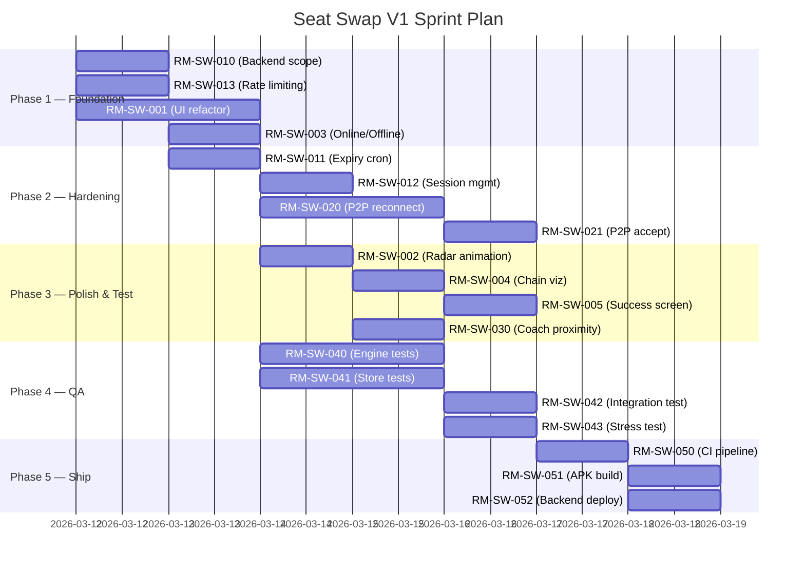

# 🚄 RailMitra — Seat Swap V1: Focused Sprint Plan

> **Scope Decision**: All non-swap features (Toilet Finder, PNR Parser, Seat Availability, Live Status) are **deferred** to V2+. This plan covers only the work needed to ship a polished, production-ready Seat Swap experience.

---

## Current State Assessment

After a full codebase audit, here's what exists vs. what needs work:

| Layer | File(s) | Status | Notes |
|-------|---------|--------|-------|
| **Swap Engine** | [swapEngine.ts](file:///c:/Users/Yogesh/dev/seat-app/services/swapEngine.ts) | ✅ Complete | Johnson's algo variant, cycle scoring, priority — all working |
| **Swap Store** | [swapStore.ts](file:///c:/Users/Yogesh/dev/seat-app/services/swapStore.ts) | ✅ Complete | CRDT merge, rate limits, validation, pruning — solid |
| **P2P Bridge (Nearby)** | [NearbyMeshBridge.ts](file:///c:/Users/Yogesh/dev/seat-app/services/NearbyMeshBridge.ts) | ⚠️ Functional, needs hardening | Permissions, event handling done; edge cases around reconnection still fragile |
| **Cloud Sync Bridge** | [meshBridge.ts](file:///c:/Users/Yogesh/dev/seat-app/services/meshBridge.ts) (CloudSyncBridge) | ✅ Functional | Polling, post, accept, cancel all working via Render backend |
| **Hybrid Bridge** | [meshBridge.ts](file:///c:/Users/Yogesh/dev/seat-app/services/meshBridge.ts) (HybridMeshBridge) | ✅ Functional | Wraps P2P + Cloud together |
| **Swap UI** | [swap.tsx](file:///c:/Users/Yogesh/dev/seat-app/app/swap.tsx) | ⚠️ Functional, needs polish | 1123 lines, monolithic; Browse/Register/MySwap tabs work but need UX improvements |
| **Home Screen** | [index.tsx](file:///c:/Users/Yogesh/dev/seat-app/app/index.tsx) | ✅ V1-focused | Already stripped to swap-only CTA |
| **Backend (Swap APIs)** | [server/src/index.ts](file:///c:/Users/Yogesh/dev/seat-app/server/src/index.ts) | ⚠️ Has non-swap endpoints | Needs cleanup — hide/disable toilet, PNR, availability endpoints for V1 |
| **DB Schema** | [schema.prisma](file:///c:/Users/Yogesh/dev/seat-app/server/prisma/schema.prisma) | ⚠️ Has non-swap models | ToiletStatus, SeatMaster, SeatReport are V2 — leave in schema but don't expose |
| **Tests** | [__tests__/](file:///c:/Users/Yogesh/dev/seat-app/__tests__) | ⚠️ Partial | swapEngine.test.ts & swapStore.test.ts exist but need expansion |

---

## Sprint Workstream Breakdown

### Workstream 1: UI/UX Polish *(Frontend)*

---

#### RM-SW-001 — Refactor `swap.tsx` into component modules
- **Assignee**: Frontend Agent
- **Priority**: P1
- **Acceptance Criteria**:
  - [ ] Extract `BrowseTab`, `RegisterTab`, `MySwapTab` into separate component files under `components/swap/`
  - [ ] Extract shared sub-components: `OfferCard`, `MatchCard`, `DemandHeatmap`, `SwapPreview`
  - [ ] `swap.tsx` orchestrates state + tabs only — under 300 lines
  - [ ] Zero visual regressions — pixel-identical to current UI
  - [ ] All extracted components typed with explicit props interfaces

---

#### RM-SW-002 — Add P2P discovery radar animation
- **Assignee**: UX/Frontend Agent
- **Priority**: P2
- **Acceptance Criteria**:
  - [ ] When mesh bridge is scanning (`meshActive && peerCount === 0`), show a pulsing radar animation
  - [ ] When peers are found, transition to a connected state with peer count badge
  - [ ] Smooth 60fps animation using `Animated` API (no `useNativeDriver: false`)
  - [ ] Works on both Android 10+ and iOS 14+

---

#### RM-SW-003 — Offline/Online status indicator
- **Assignee**: Frontend Agent
- **Priority**: P1
- **Acceptance Criteria**:
  - [ ] Persistent status bar showing one of: `🟢 Online (Cloud + P2P)` | `🟡 P2P Only (Offline)` | `🔴 No Connections`
  - [ ] Uses React Native `NetInfo` to detect connectivity changes
  - [ ] Updates in real-time as network state changes
  - [ ] Positioned consistently in the swap screen header

---

#### RM-SW-004 — Multi-party swap chain visualization
- **Assignee**: UX/Frontend Agent
- **Priority**: P2
- **Acceptance Criteria**:
  - [ ] For `TRIANGULAR` and `CHAIN` match types, render a visual chain diagram showing seat flow
  - [ ] Chain shows: `[You: MB] → [Passenger 2: LB] → [Passenger 3: UB] → [You]`
  - [ ] Highlight the current user's node distinctly
  - [ ] Each node shows coach/seat info and seat type with color coding

---

#### RM-SW-005 — Swap success celebration screen
- **Assignee**: Frontend Agent
- **Priority**: P3
- **Acceptance Criteria**:
  - [ ] After accepting a swap, show a full-screen success animation (confetti/checkmark)
  - [ ] Display clear instructions: "Walk to Coach B3, Seat 17. Show this screen to the other passenger."
  - [ ] Include a "Mark as Completed" button to close the swap lifecycle
  - [ ] Include a "Report Problem" option if the swap fails in person

---

### Workstream 2: Backend/DB Hardening *(Server-Side)*

---

#### RM-SW-010 — Scope backend to swap-only endpoints for V1
- **Assignee**: Backend Agent  
- **Priority**: P1
- **Acceptance Criteria**:
  - [ ] Comment out or gate behind `V2_FEATURES` env flag: `/api/reports`, `/api/toilets`, `/api/pnr`, `/api/utilities`, `/api/trains/:trainNo/availability`
  - [ ] Keep active: `/api/swaps/*`, `/api/health`, `/api/metrics`, `/api/reputation`
  - [ ] Root `/` page updated to say "Seat Swap Sync Server v1.0.0"
  - [ ] No DB migration changes — leave V2 models in schema but unused
  - [ ] All disabled routes return `{ error: "This feature is coming in V2" }` with HTTP 501

---

#### RM-SW-011 — Add swap expiry cron job
- **Assignee**: Backend Agent
- **Priority**: P1
- **Acceptance Criteria**:
  - [ ] Server-side job runs every 15 minutes
  - [ ] Marks all `OPEN` swaps past `expiresAt` as `EXPIRED`
  - [ ] Logs event in `SwapEvent` table for each expired swap
  - [ ] Broadcasts SSE `OFFER_EXPIRED` event to connected clients
  - [ ] Add telemetry counter for expired swaps

---

#### RM-SW-012 — Implement server-side swap session management
- **Assignee**: Backend Agent
- **Priority**: P1
- **Acceptance Criteria**:
  - [ ] `POST /api/swaps/:swapId/accept` now creates a `SwapSession` record
  - [ ] Links both `SwapRequest` records to the session via `sessionId`
  - [ ] New endpoint: `POST /api/sessions/:sessionId/complete` — marks session and both swaps as `COMPLETED`
  - [ ] New endpoint: `POST /api/sessions/:sessionId/fail` — marks session as `FAILED`, reopens both swaps
  - [ ] SSE broadcasts for session state changes

---

#### RM-SW-013 — Rate limiting and abuse prevention on server
- **Assignee**: Backend Agent
- **Priority**: P1
- **Acceptance Criteria**:
  - [ ] Max 3 active swap offers per `userId` (server-side enforcement, mirrors client-side)
  - [ ] Max 10 API calls per minute per IP for swap endpoints (use `express-rate-limit`)
  - [ ] Reject swap offers with invalid seat numbers (>80), invalid coach IDs (>4 chars), or same current/desired type
  - [ ] Log rate-limit violations to telemetry

---

### Workstream 3: P2P Mesh Hardening *(Transport Layer)*

---

#### RM-SW-020 — Handle P2P reconnection edge cases
- **Assignee**: P2P/Native Agent
- **Priority**: P1
- **Acceptance Criteria**:
  - [ ] When Nearby connection drops, auto-retry discovery after 5s backoff (max 3 retries)
  - [ ] When switching from WiFi to mobile data, don't restart the P2P bridge unnecessarily
  - [ ] When app is backgrounded for >5 minutes and foregrounded, re-initialize P2P gracefully
  - [ ] Add structured logging for all connection state transitions
  - [ ] No duplicate peer counts after reconnection (dedup by `endpointName/deviceId`)

---

#### RM-SW-021 — Broadcast swap acceptance over P2P
- **Assignee**: P2P/Native Agent
- **Priority**: P1
- **Acceptance Criteria**:
  - [ ] When User A accepts User B's swap via P2P, User B's device auto-updates to `MATCHED` state
  - [ ] Handle the ID prefix mismatch (`p2p_` prefix) correctly in both directions
  - [ ] If the accepted user is not connected via P2P (only cloud), fall through to cloud channel
  - [ ] Add timeout: if no acknowledgment within 60s, show "Waiting for confirmation" UI

---

#### RM-SW-022 — Implement gossip relay for train-wide coverage
- **Assignee**: P2P/Native Agent
- **Priority**: P3 *(V1.1)*
- **Acceptance Criteria**:
  - [ ] Received messages with `ttl > 0` are re-broadcast to all connected peers
  - [ ] Decrement TTL by elapsed time before re-broadcast
  - [ ] Dedup by `senderId + timestamp` — never re-broadcast duplicates
  - [ ] Cap relay hops at 3 (covers ~500m, full train length)

> [!NOTE]
> This is marked P3 because V1 will primarily rely on Cloud Sync for cross-train coverage. Gossip relay enhances the offline-only scenario.

---

### Workstream 4: Swap Engine Improvements *(Algorithm)*

---

#### RM-SW-030 — Add coach proximity bonus to cycle scoring
- **Assignee**: Algorithm Agent
- **Priority**: P2
- **Acceptance Criteria**:
  - [ ] Swaps between passengers in the same or adjacent coach get a +0.1 scoring bonus
  - [ ] Coach proximity calculated from coach ID (e.g., B1 ↔ B2 = adjacent, B1 ↔ S5 = far)
  - [ ] Configurable proximity weight constant
  - [ ] Unit tests covering same-coach, adjacent-coach, and far-coach scenarios

---

#### RM-SW-031 — Optimize cycle finder for >50 concurrent swaps
- **Assignee**: Algorithm Agent
- **Priority**: P3 *(V1.1)*
- **Acceptance Criteria**:
  - [ ] Benchmark current `findAllCycles()` with 50, 100, and 200 swap nodes
  - [ ] If >500ms on-device for 100 nodes, implement early termination after finding top-K cycles
  - [ ] Add execution time logging to `findBestMatches()`
  - [ ] Graph building remains O(n²) but cap at n=100 (oldest swaps evicted first)

---

### Workstream 5: Testing & QA *(Quality)*

---

#### RM-SW-040 — Expand swapEngine unit tests
- **Assignee**: QA Agent
- **Priority**: P1
- **Acceptance Criteria**:
  - [ ] 100% branch coverage for `buildSwapGraph`, `findAllCycles`, `scoreCycle`, `selectBestMatches`
  - [ ] Test cases: 0 swaps, 1 swap, 2-way direct, 3-way triangular, 5-way chain, overlapping cycles
  - [ ] Edge cases: all same type desired, expired swaps mixed in, duplicate device IDs
  - [ ] Priority scoring tested: elderly > medical > family > preference
  - [ ] Freshness decay verified with mocked `Date.now()`

---

#### RM-SW-041 — Expand swapStore unit tests
- **Assignee**: QA Agent
- **Priority**: P1
- **Acceptance Criteria**:
  - [ ] CRDT merge: new swap added, existing swap updated (newer wins), own swaps not merged back
  - [ ] Rate limiting: 4th active swap rejected, expired swaps don't count toward limit
  - [ ] Storage cap: 201st swap triggers eviction of oldest terminal-state swap
  - [ ] Status transitions: test all valid paths, verify invalid transitions return null
  - [ ] Input validation: all edge cases for train number, coach ID, seat number formats

---

#### RM-SW-042 — Integration test: full swap lifecycle
- **Assignee**: QA Agent
- **Priority**: P2
- **Acceptance Criteria**:
  - [ ] End-to-end flow: Create swap → Browse → Find match → Accept → Complete
  - [ ] Test with MockMeshBridge simulating 2 devices
  - [ ] Verify SSE events fire correctly through the sequence
  - [ ] Verify event log contains all state transitions
  - [ ] Test cancellation mid-flow and re-registration

---

#### RM-SW-043 — P2P sync stress test
- **Assignee**: QA Agent
- **Priority**: P2
- **Acceptance Criteria**:
  - [ ] Simulate 8 concurrent peers sending swap offers simultaneously
  - [ ] Verify no duplicate swaps in local store after merge
  - [ ] Verify no data corruption when merge + create happen concurrently
  - [ ] Verify expired messages are silently dropped (TTL enforcement)

---

### Workstream 6: DevOps & Deployment *(Infrastructure)*

---

#### RM-SW-050 — Configure CI pipeline for swap-only scope
- **Assignee**: DevOps Agent
- **Priority**: P1
- **Acceptance Criteria**:
  - [ ] GitHub Actions workflow: `lint → test → build` on every PR
  - [ ] Run `swapEngine.test.ts` and `swapStore.test.ts` in CI
  - [ ] Server Docker build & push on merge to `main`
  - [ ] Fail the pipeline if any swap-related test fails

---

#### RM-SW-051 — Production build & APK generation
- **Assignee**: DevOps Agent
- **Priority**: P1
- **Acceptance Criteria**:
  - [ ] EAS Build configured for internal distribution (`preview` profile)
  - [ ] APK installs and runs correctly on Android 10-14 devices
  - [ ] Splash screen shows RailMitra branding
  - [ ] App size under 30MB

---

#### RM-SW-052 — Backend deployment validation
- **Assignee**: DevOps Agent
- **Priority**: P1
- **Acceptance Criteria**:
  - [ ] Render deployment auto-deploys on `main` push
  - [ ] `/api/health` returns `200` with DB connection confirmed
  - [ ] SSE stream test: open connection, receive `CONNECTED` event
  - [ ] Swap POST/GET/Accept cycle works end-to-end against production server

---

## Priority & Sequencing

---

## Scope Guardrails

> [!WARNING]
> The following are **explicitly out of scope** for V1. Any request involving these features must be pushed to V2:

| Feature | Status | Reason |
|---------|--------|--------|
| Toilet Finder / Queue Reporting | ❌ Deferred | Separate subsystem, doesn't affect swap core |
| PNR SMS Parsing | ❌ Deferred | Nice-to-have for auto-filling train details, but manual input works |
| Seat Availability / Live Status | ❌ Deferred | Requires SeatMaster data population & external API integration |
| User Accounts / Login | 🚫 Rejected | **Violates offline-first, no-account architecture** |
| Server-side matching | 🚫 Rejected | **Violates on-device graph engine constraint** — server provides _optional_ sync only |
| iOS Multipeer Connectivity | ❌ Deferred | Android-first for V1; iOS P2P requires separate native module |
| ML-based priority scoring | ❌ Deferred | Current heuristic scoring is sufficient for V1 user base |

---

## Agent Assignment Summary

| Agent | Tickets | Focus |
|-------|---------|-------|
| **Frontend** | RM-SW-001, 003, 005 | Component refactor, status indicators, celebration UI |
| **UX/Frontend** | RM-SW-002, 004 | Animations, chain visualization |
| **Backend** | RM-SW-010, 011, 012, 013 | API scoping, cron jobs, session management, rate limiting |
| **P2P/Native** | RM-SW-020, 021, 022 | Connection hardening, acceptance flow, gossip relay |
| **Algorithm** | RM-SW-030, 031 | Scoring improvements, performance optimization |
| **QA** | RM-SW-040, 041, 042, 043 | Unit tests, integration tests, stress tests |
| **DevOps** | RM-SW-050, 051, 052 | CI/CD, APK builds, deployment validation |

---

> [!IMPORTANT]
> **Start with Phase 1 (RM-SW-010, 013, 001, 003)** — these are the foundation for everything else. Phase 2 depends on Phase 1 server work completing. QA can start in parallel once store/engine code is stable.

Ready to begin executing. Which workstream or ticket should we start with?
