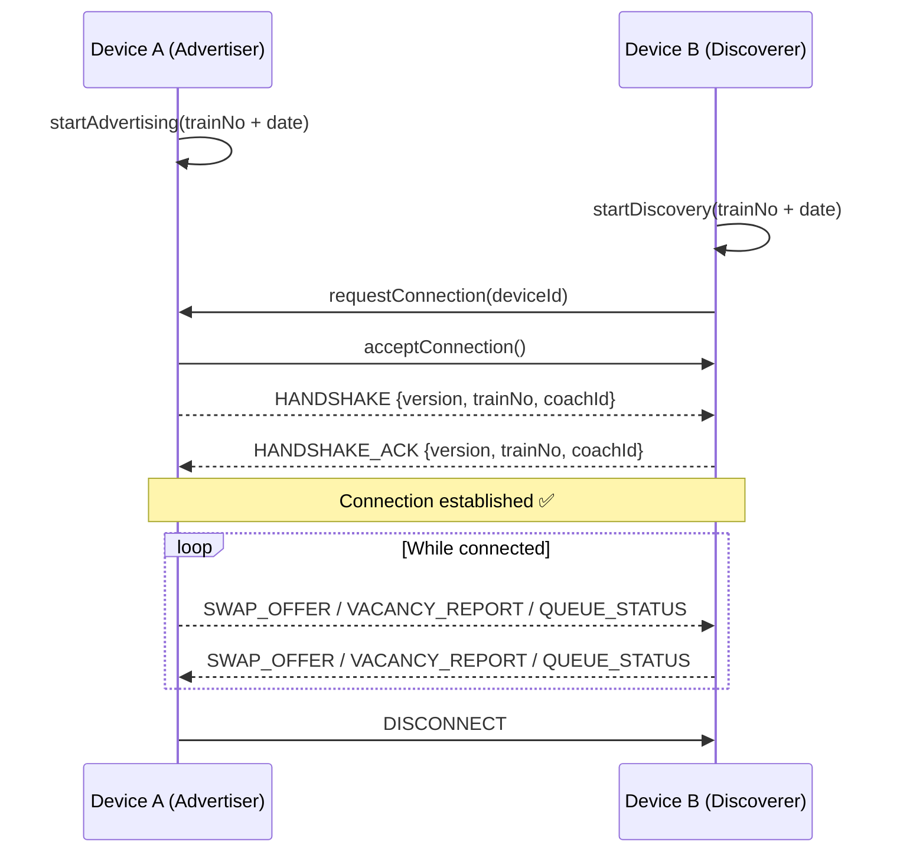

# Offline Mesh Network — P2P Protocol Design Spec

## Overview

Enables train passengers to share seat swap offers, vacancy reports, and toilet queue status **without internet** using device-to-device communication. This is critical for Indian trains where connectivity is sparse through tunnels, rural areas, and underground sections.

## Technology: Android Nearby Connections API

| Property | Value |
|----------|-------|
| Strategy | `P2P_CLUSTER` (many-to-many, no central node) |
| Transport | Wi-Fi Direct + Bluetooth |
| Range | ~100m (covers 4-5 coaches) |
| Payload | Byte stream (JSON encoded) |
| Authentication | Pre-shared key derived from `trainNo + journeyDate` |

### Why P2P_CLUSTER?

- **No central server needed** — any device can discover and connect to any other
- Passengers join/leave dynamically (boarding/alighting at stations)
- Supports broadcast (one-to-many) for swap announcements
- Handles up to ~8 simultaneous connections per device

## Connection Lifecycle



## Service ID Format

```
com.seatseeker.mesh.<trainNo>.<YYYYMMDD>
```

Example: `com.seatseeker.mesh.12301.20260220`

This ensures devices only discover peers on the **same train on the same day**.

## Payload Format

All payloads are JSON-encoded UTF-8 byte arrays.

### Common Header

```json
{
  "version": 1,
  "type": "SWAP_OFFER | VACANCY_REPORT | QUEUE_STATUS | HEARTBEAT",
  "senderId": "<hashed_device_id>",
  "trainNo": "12301",
  "timestamp": 1740000000000,
  "ttl": 300
}
```

- `ttl` (seconds): How long this message should be re-broadcast. Prevents stale data flooding.

### SWAP_OFFER

```json
{
  "version": 1,
  "type": "SWAP_OFFER",
  "senderId": "abc123hash",
  "trainNo": "12301",
  "timestamp": 1740000000000,
  "ttl": 600,
  "payload": {
    "currentCoach": "B3",
    "currentSeat": 42,
    "currentType": "UPPER",
    "desiredType": "LOWER",
    "journeySegment": {
      "from": "NDLS",
      "to": "HWH"
    },
    "note": "Elderly passenger, need lower berth"
  }
}
```

### VACANCY_REPORT

```json
{
  "version": 1,
  "type": "VACANCY_REPORT",
  "senderId": "def456hash",
  "trainNo": "12301",
  "timestamp": 1740000000000,
  "ttl": 300,
  "payload": {
    "coach": "S4",
    "seat": 17,
    "status": "EMPTY",
    "verifiedBy": "VISUAL",
    "vacantFrom": "CNB",
    "vacantTo": "HWH"
  }
}
```

### QUEUE_STATUS

```json
{
  "version": 1,
  "type": "QUEUE_STATUS",
  "senderId": "ghi789hash",
  "trainNo": "12301",
  "timestamp": 1740000000000,
  "ttl": 120,
  "payload": {
    "coach": "B2",
    "toiletLocation": "REAR",
    "queueLength": 4,
    "estimatedWaitMinutes": 8,
    "waterAvailable": true
  }
}
```

## Security Model

### Connection Authentication

1. Both devices compute: `HMAC-SHA256(trainNo + journeyDate, "seatseeker-mesh-v1")`
2. Exchange HMAC during handshake
3. Reject if HMAC doesn't match (prevents random strangers from connecting)

### Data Integrity

- All payloads signed with sender's device-derived key
- Messages older than `ttl` are silently dropped
- Duplicate detection via `senderId + timestamp` tuple
- No personal data transmitted — only seat numbers, coach IDs, and hashed device IDs

### Spam Prevention

- Max 1 SWAP_OFFER per sender per 60 seconds
- Max 5 VACANCY_REPORTs per sender per 5 minutes
- Peers that exceed limits are temporarily muted (30 min cooldown)

## Relay / Gossip Protocol

Since Nearby Connections has ~100m range (4-5 coaches), messages need to propagate across the full train (~500m for 20+ coaches):

1. When Device A receives a message from Device B, it checks `ttl`
2. If `ttl > 0`, it decrements `ttl` by the elapsed time and re-broadcasts to all its connections
3. Duplicate messages (same `senderId + timestamp`) are **not** re-broadcast
4. This creates a gossip network that covers the entire train within ~3 hops

## Expo / React Native Integration

> ⚠️ **Nearby Connections requires native Android modules** that cannot run in Expo Go.

### Implementation Options

| Option | Effort | Compatibility |
|--------|--------|--------------|
| Expo Development Build + custom native module | High | Full functionality |
| `react-native-nearby-connections` community package | Medium | Partial (may need patches) |
| WebRTC as fallback (requires at least one device with internet) | Low | Limited offline capability |

### Recommended Approach

1. Build the mesh logic as a **pure TypeScript module** (message parsing, relay, dedup)
2. Create a **native bridge interface** (`MeshBridge.ts`) with method stubs
3. When ready for production, implement the native Android module
4. For development/testing, use a **mock mesh** that simulates multi-device communication

## Future Enhancements

- **iOS support**: Apple's Multipeer Connectivity framework (similar to Nearby Connections)
- **Mesh analytics**: Track which coaches/seats are most frequently reported
- **Smart relay**: Prioritize forwarding swap offers that match known local preferences
- **Compression**: Use MessagePack instead of JSON for lower bandwidth consumption
